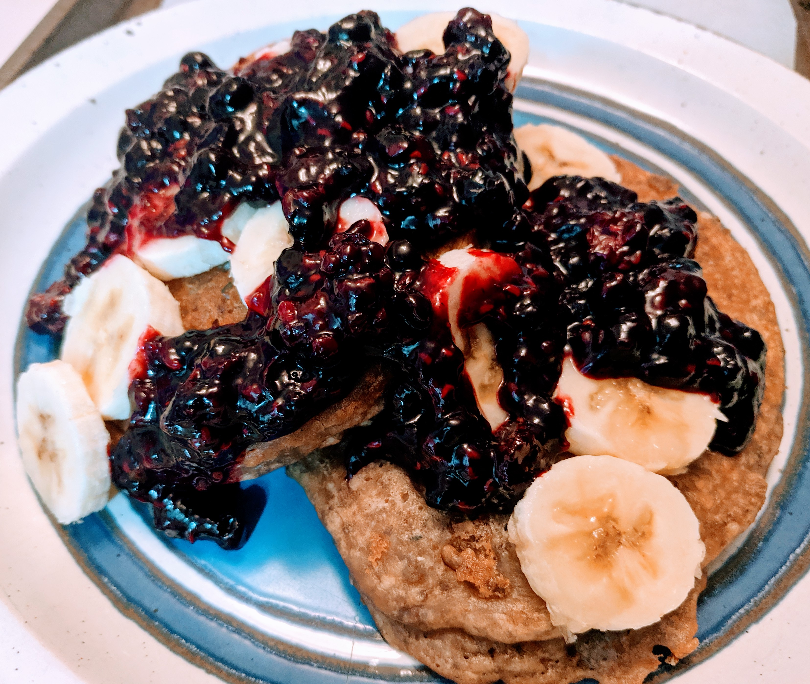

## Ingredients

### Lemon Chia Pancakes

* 1 cup whole wheat flour
* 1 teaspoon baking powder
* 1/2 teaspoon baking soda
* 2 tablespoons organic pure cane sugar
* pinch of mineral salt
* 3 tablespoons chia seeds
* 2 tablespoons hemp hearts
* 1 scoop soy/hemp protein powder (optional)
* 1 cup buttermilk (one cup soy milk + juice from 1 lemon)
* zest of 1 – 2 lemons
* 1 teaspoon vanilla
* 2 tablespoons olive oil
* oil, for greasing
* 1 banana

### Berry compote

* 2 -- 4 cups frozen mixed berries
* 1 -- 2 tbsp sugar
* 1/2 -- 1 tbsp corn starch

## Directions

### For the pancakes

Mix the dry ingredients together. Ensure the protein powder is mixed thoroughly
with the other dry ingredients, so it doesn't get clumpy. Make the
"buttermilk": juice a lemon, remove the seeds, combine the juice with the milk
and stir until the texture/viscosity visibly changes (5 -- 10 seconds). Add the
buttermilk to the dry ingredients and mix until homogeneous. The batter should
be quite thick. If you think it is too thick, add more soy milk. Add the olive
oil and teaspoon of vanilla until combined.

To a heated frying pan on medium heat: add oil, add batter, let the pancakes
begin! The secret to knowing when they're done on the first side is to look for
"dry" edges and air bubbles popping up through the centre.

Plate them, top with some banana slices if desired, and ladle on some berry
compote.

### For the compote

Pour the frozen berries into a sauce pan on medium heat. Stir regularly and
help the berries break down by poking/prodding/squishing them with a wooden
spoon. When you've got a textured berry juice, raise the heat until the mixture
starts to come to a boil, then add the sugar and the corn starch. Reduce heat
to simmer and stir while the corn starch changes the viscosity of the
mixture. Enjoy!
