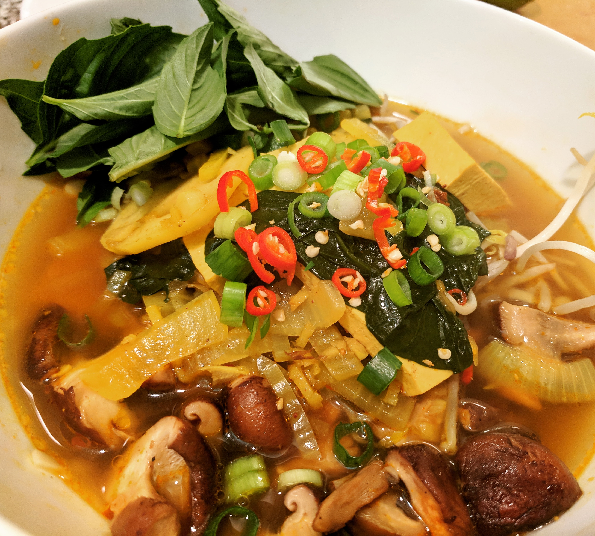

## Ingredients

### Broth

* Vegetable broth (8 cups)
* Water (2-3 cups)
* 1 yellow onion 
* 4-6 garlic cloves
* 1 thumb length ginger
* Garam masala
* Turmeric
* Soy sauce
* Chili oil

### Food items

* Sesame Oil
* Wide rice noodles
* Shiitake mushrooms
* Tofu

### Garnishes 

* Bean sprouts
* Thai red chili peppers
* Thai basil
* Green onion

## Directions

### The Broth

Sautee the onion and garlic on medium-high heat for about 5 minutes. Add
vegetable broth and water. Bring to a boil and turn down heat to simmer. Add
ginger, garam masala (2 tbsp?), turmeric (1 tbsp?) and soy sauce (1-2 tbsp) to
taste. Add ~1 tbsp chili oil (for the heat, but mostly the MSG, let's be
honest).

### The Mushrooms

In the meantime, sautee the shiitake mushrooms in a nice little mix of sesame
and grapeseed oil (or whatever your preference is). Add light salt and/or pepper
and/or lemon to accent their natural savoury flavour. When they've seen a nice
little fry, take 'em off the heat and set them aside.

Optional idea: add the mushrooms right into the broth so that the broth picks up
that savoriness. I didn't do this, because I wanted to keep the fried 'shroom
texture.

### The Noodles

While you're frying the mushrooms, bring some water to a boil in yet another
pot. Boil the rice noodles until they're done. When they're finished, pour them
into a strainer to get rid of the water, and run them under cold water to bring
down their temperature. Pour a tbsp of sesame oil over them so they don't stick
together and serve into bowl(s).

### The Tofu

The more kinds you generate, the happier you'll be. Pho is about variety!

The simplest way to prep some protein for the pho is to cut up a block of firm
tofu into bricks and to add them directly into the broth to soak up the flavour.

Additionally, you could dry fry about half of the bricks in a pan until they
stop "screaming". They'll come out golden brown and crispy, with a unique
texture that I find very appealing.

Galaxy brain: marinate the tofu in a mix of oil and nutritional yeast. Sautee
until golden and slightly crispy.

Finally, you could also buy a block of smoked tofu (or "Sriracha tofu") and use
them for protein-filled pho toppings.

### The Garnishes

To prepare the garnishes, pluck the basil from its leaves; chop the green onion,
rinse the bean sprouts, and chop the Thai red chilis into thin rounds like you
did the green onion. Serve on a plate so that each dinner guest can add
garnishes to their liking. Augment with a dish of soy sauce and one of chili
oil, Sriracha, etc.
